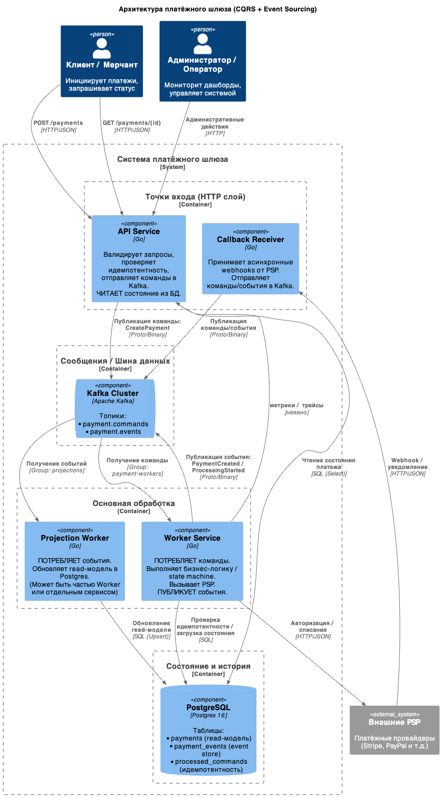

**Платежный шлюза на Go**

* Go
* PostgreSQL
* ~~Kafka~~
* ~~Prometheus~~
* ~~Grafana~~
* ~~Jaeger~~
* Docker

**Установка:**

```cli
git clone git@github.com:smbya/PayWay.git .
docker-compose up -d
```

**Запросы:**


**TODO:**

[x] Добавить общий конфиг
[ ] Добавить в readme инструкцию по запуску и запросам
[ ] Добавить логирование на всех основных уровнях (взять slog)
[ ] Добавить миграции (gomigrate/goose)
[ ] Сделать нормальную обработку данных, убрать захардкоженые данные
[ ] Проверить экспортированные структуры на необходимость быть публичными. Убрать где это не нужно
[ ] Использовать интерфейсы только там, где это необходимо. В других местах убрать
[ ] сделать ближе к прод-реди решению (то до чего руки не дошли)
[ ] merge webserver and controller in file struct
[ ] Перенести /db/ в `internal/repository`,

> internal/repository/repository.go - только интефрейсы
> internal/repository/posgresql/repository.go
> internal/repository/posgresql/db/

[ ] Переиспользование, разделение сервисов. Поправить выходные параметры
[ ] Создать handler model в контроллере
[ ] Сделать монорепу


===

**План проекта**

[Task.md](assets/task.md)



